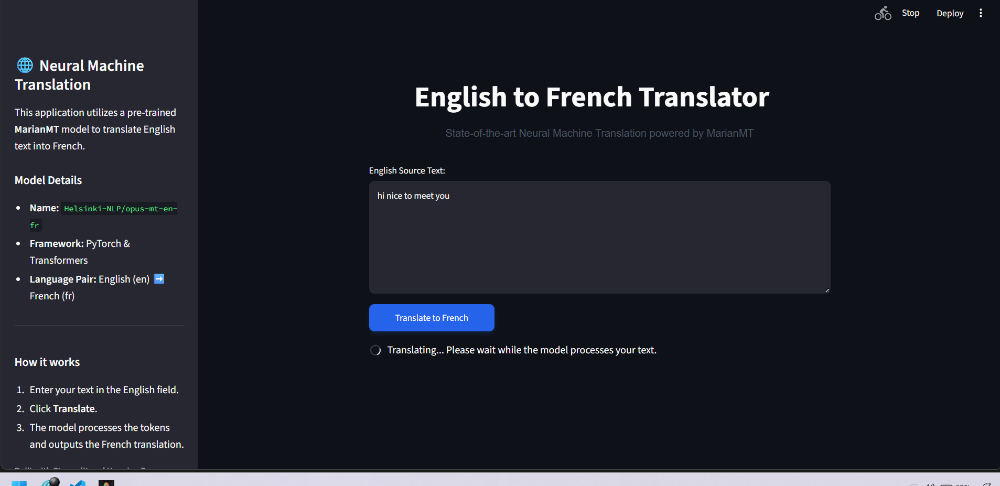
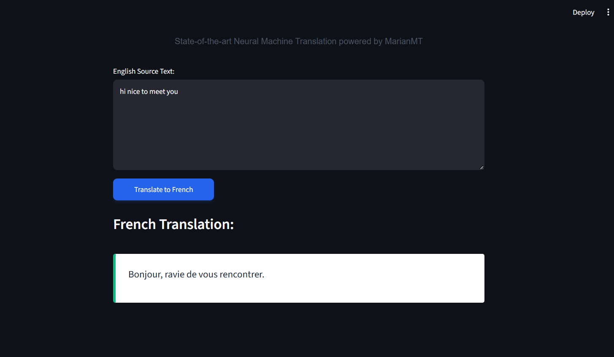

# Neural Machine Translation using MarianMT

A Streamlit-based **Neural Machine Translation (NMT)** application that translates English text into French using the pre-trained **Helsinki-NLP/opus-mt-en-fr** MarianMT model from Hugging Face Transformers. The project demonstrates how state-of-the-art Natural Language Processing models can be deployed through a simple and interactive web interface.

---

## Features

- 🌍 English to French Translation
- 🤖 Powered by MarianMT (Helsinki-NLP/opus-mt-en-fr)
- ⚡ Fast model loading using caching
- 🎨 Interactive Streamlit web interface
- 📝 Clean and responsive user interface
- ✅ Error handling for invalid inputs
- 🚀 No training or fine-tuning required

---

## Technologies Used

- Python 3.11
- Streamlit
- PyTorch
- Hugging Face Transformers
- MarianMT
- SentencePiece

---

## Installation

Clone the repository:

```bash
git clone https://github.com/JAIKRISHNA2007/Neural-Machine-Translation.git
cd Neural-Machine-Translation
```

Install dependencies:

```bash
pip install -r requirements.txt
```

Run the application:

```bash
streamlit run app.py
```

---

## Project Structure

```text
Neural-Machine-Translation/
│
├── app.py
├── translator.py
├── requirements.txt
├── README.md
├── LICENSE
├── .gitignore
└── images/
    ├── home.png
    └── result.png
```

---

## Demo

Enter English text and click **Translate to French** to generate the translated output.

### Example

**Input**

```text
Hi, nice to meet you.
```

**Output**

```text
Bonjour, ravi de vous rencontrer.
```

---

## Screenshots

### Home Page



### Translation Result



---

## Future Improvements

- 🌐 Support multiple language pairs
- 🎤 Voice-to-text translation
- 📄 Document translation (PDF, DOCX, TXT)
- 📜 Translation history
- ☁️ FastAPI backend for deployment
- 🔊 Text-to-Speech output

---

## Internship Information

This project was developed as part of the **AI Internship** at **Codtech IT Solutions Private Limited**.

- **Intern ID:** CTTSI62
- **Intern:** JAI KRISHNA S

---

## Author

**JAI KRISHNA S**

GitHub: https://github.com/JAIKRISHNA2007

---

## License

This project is licensed under the **MIT License**. See the `LICENSE` file for more details.